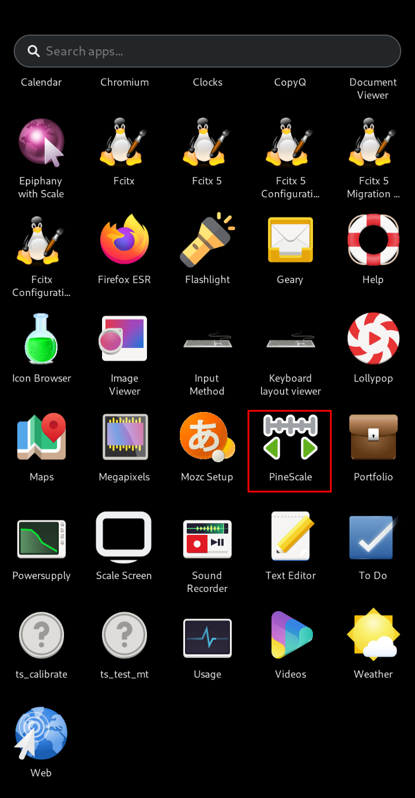
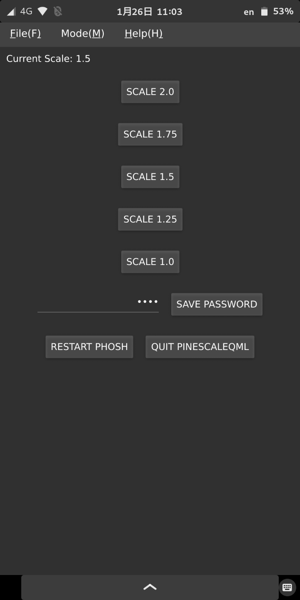

# PineScaleQML for PinePhone  

# Preface  
PineScaleQML is a scaling software for PinePhone. 
You can easily change the scaling of the screen just by pressing the scaling button. 
 
This article uses Mobian, 
<u>you should be able to install it on other Linux distributions as well.</u> 
(Ex. Manjaro ARM, openSUSE TW, ... etc) 
 
PineScaleQML uses the <I>"**wlr-randr**"</I> package for screen scaling. 
 
*Note:* 
*PineScaleQML is created in Qt 5.15, so it requires Qt 5.15 library.* 
 

# 1. Install the necessary dependencies for PineScaleQML
Create a directory for installing Qt libraries on PinePhone. 
* libQt5Core.so.5
* libQt5Gui.so.5
* libQt5Quick.so.5
* libQt5QuickControls2.so.5
* libQt5Qml.so.5
* libQt5QmlModels.so.5
* libQt5Network.so.5
 

Get the latest updates on PinePhone. 

    sudo apt-get update  
    sudo apt-get dist-upgrade  
 

Install the dependencies required to build the PineScaleQML.  

    sudo apt-get install qt5-qmake qt5-qmake-bin \
                         libqt5core5a libqt5gui5 libqt5quick5 libqt5quickcontrols2-5 \
                         libqt5qml5 libqt5qmlmodels5 libqt5network5 \
                         wlr-randr
 
 

# 2. Compile PineScaleQML
Download the source code from PineScaleQML's Github. 

    git clone https://github.com/presire/PineScaleQML.git PineScaleQML
 

Use the qmake command to compile the source code of PineScaleQML. 
The default installation directory is <I>**/${PWD}/PineScaleQML**</I>. 

The recommended installation directory is the home directory. (Ex. <I>**${HOME}/InstallSoftware/PineScaleQML**</I>)

    cd PineScaleQML

    mkdir build && cd build

    qmake ../PineScaleQML.pro PREFIX=<The directory you want to install in>
    make -j $(nproc)
    make install
 
 

# 3. Create DesktoEntry for PineScaleQML
    vi ~/.local/share/applications/PineScaleQML.desktop
 

    [Desktop Entry]
    Type=Application
    Name=PineScaleQML
    GenericName=PineScaleQML
    Comment=Scale Screen
    Icon=/<PineScaleQML Install Directory>/PineScaleQML.svg
    Exec=/<PineScaleQML Install Directory>/PineScaleQML %F
    Terminal=false
    Categories=Utility;
 

 
 
 

# 4. Execute PineScaleQML
Make sure you can execute **PineScaleQML**. 
 

 
 
 
